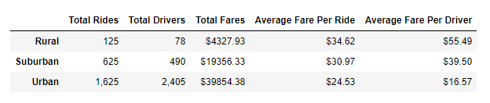
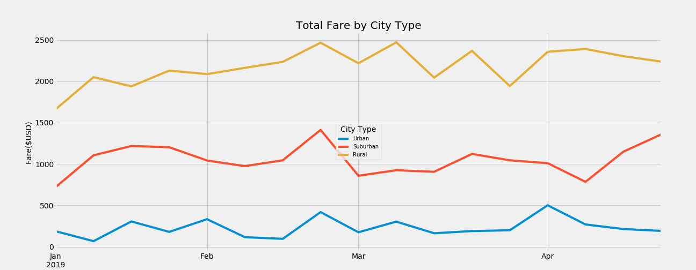
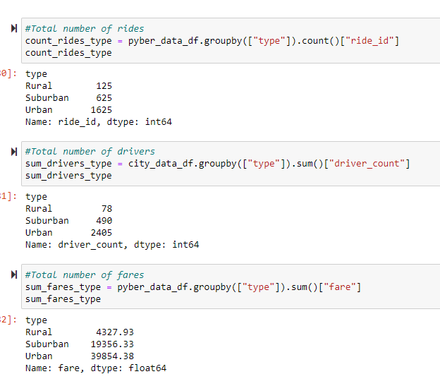
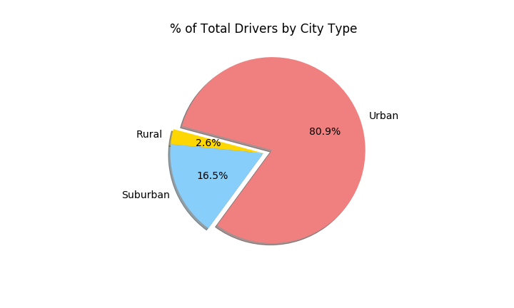

# PyBer_Analysis

## Project Challenge Overview

Given the task to perform exploratory analysis for PyBer to help improve access to ride-sharing services and determine affordability for neighborhoods.  The following deliverables for the analysis are:

- Technical Analysis Deliverable 1: A DataFrame that summarizes the key metrics for the ride-sharing data by city type.
- Technical Analysis Deliverable 2: A multiple-line chart, with one line for each city type, that shows the sum of the fares for each week.
- Delivering Results: A written report of your results.

## Resources

- Data Sources: city_data.csv, ride_data.csv
- Software: Python 3.7.6 ('base':conda), Visual Studio Code 1.46.1, Juypter Notebook

## Technical Analysis Deliverable 1:

To create the summary DataFrame, follow these steps:

  1. From the merged DataFrame get the total rides, total drivers, and total fares for each city type using the groupby() function on the city type.
  2. Calculate the average fare per ride and the average fare per driver for each city type.
  
To format the summary DataFrame, follow these steps:

1. Delete the index name.
2. Create the summary DataFrame with the appropriate columns, and apply formatting where appropriate.

After merging the DataFrames, do the following:

1. Rename columns
2. Create a new DataFrame from the pivot table DataFrame on the given dates, '2019-01-01':'2019-04-28', using loc.
3. Create a new DataFrame by setting the DataFrame you created in Step 8 with resample() in weekly bins, and calculate the sum() of the fares for each week in the resampled data.
4. Plot the DataFrame

### Summary

The purpose of this assignment was to create a summary dataframe of the key metrics for the ride sharing data and to show the relationship between each city type (urban, suburban, rural)  and total fares.  An analysis was performed from January to early May 2019.  Analyze the data to create the technical deliverables by inspecting the data first, merged data set into one, performed calculations, and created a summary dataframe that was used to build a chart. Created the summary dataframe by calculating the key metrics which were the total rides, total drivers, and total fares.  After the totals were found, I calculated the average fare per ride and the average fare per driver.  

 
As shown in the table, the Rural area had the highest average fare per ride out of the three areas.  Urban being the lowest.  The chart visualizes the fare($USD) from January 2019 to the beginning of May.  

## Technical Analysis Deliverable 2:

1. What challenges or difficulties did you encounter? 
2. Explain how you overcame any challenges or difficulties.

### Challenges Faced

After inspecting the CSV files, I noticed that the ride_data.csv has 2376 rows and city_data.csv has 121 rows.  Merged the two data sets into one.  Both data sets had a "City" column in common.  As I was finding the key metrics for the data summary.  The challenge I faced was finding the total drivers.  I overcame this issue by going back to the city_data_df.  The issue after both data sets were merged was the driver_count was now based on the rides and city type instead of the city type along.  I went back to the city_data_df to calculate the sum of the driver by city type. See the calculation below.

## Technical Analysis Deliverable 3:

1. What recommendations would you give the CEO for addressing any disparities among the city types?
2. Provide two additional analyses you could do to gain more insight into the data, like using other datasets.
3. What technical steps would you take to perform the additional analyses?

### Recommendations

One of the disparities, I noticed was the number of drivers per city type.  Urban has 81% of drivers per city type.  Recommend adding more drivers to the suburban and rural.

Additional analysis that will provide insight into why the urban city type has the most driver is the city population. Using the census bureau report or historian data to find the city population.  I would plot a graph to compare the number of drivers and the city population.  I would use python and matplotib.  I look for a trend. 

Another additional analysis that will provide insight into the data would be the number of rides by months to see if there is a trend over seasons.  I would use the current merged data set. As of now, the urban city type has the most drivers and the most rides.  I will plot a line graph to see if the number of rides will increase or decrease per city type of an entire year.   I would also check the previous years to see if the company has improved or not.  I would use python and matplotib software.  

I would also check out competitors such as Lyft and Uber's fares to find out if Pyber's current fares are suitable.

